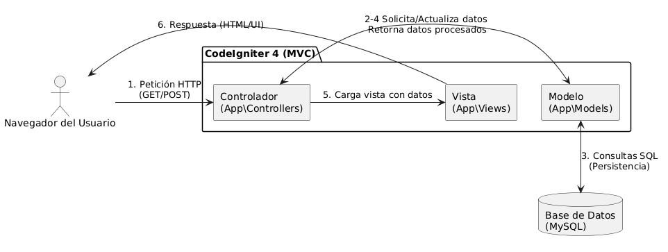
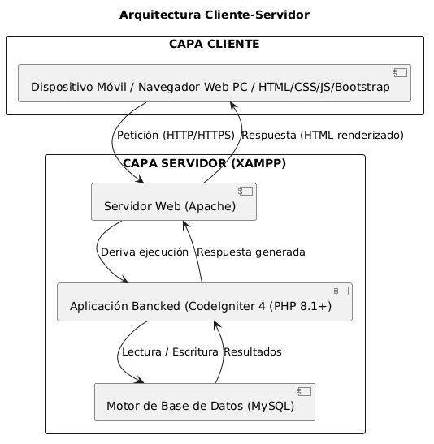
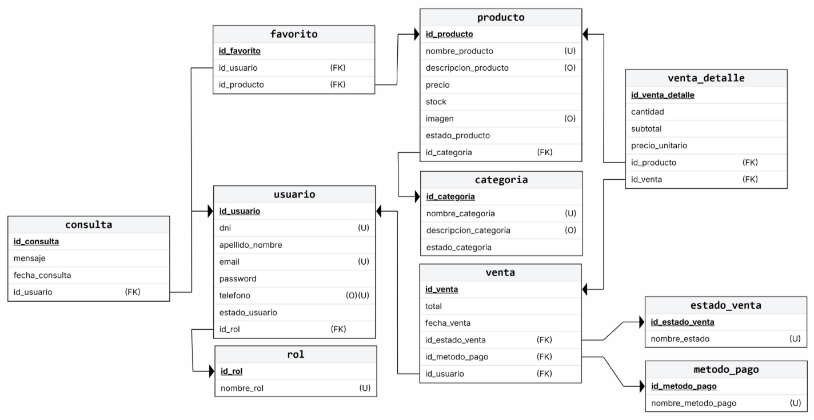

# Documentación

<aside>


**Versión: 1.3.3**

**Fecha: 17/8/2026**

**Autor: Vera Pablo G.**

**Cambios: Actualizacion de plan de despliegue sección 6.4 item 4,5,6 **

</aside>

---

## Capítulo I: Generalidades del Proyecto

### 1.1 Introducción

El proyecto **"Estética - BV"** consiste en el diseño y desarrollo de una plataforma de comercio electrónico (E-commerce) especializada en el sector de la estética femenina. El proyecto surge de la necesidad práctica de digitalizar un negocio real ya existente, propiedad de Belén Vera ("BV"), permitiendo la transición de un modelo de atención tradicional hacia el entorno digital.

En el contexto académico, este sistema se desarrolla como parte de la asignatura *Taller de programación I*, con el objetivo de aplicar conceptos de ingeniería de software, bases de datos, control de acceso basado en roles, persistencia de datos y operaciones fundamentales de gestión de información. La plataforma busca resolver la falta de presencia en línea del negocio, optimizando la interacción entre la estética y sus clientes mediante una interfaz intuitiva y segura.

### 1.2 Propósito y Alcance

El propósito principal de "Estética - BV" es automatizar el proceso de venta de productos estéticos y optimizar de manera integral la gestión de inventario del negocio. A través de la centralización de las operaciones en una plataforma web, se busca reducir el margen de error en el stock, facilitar la administración de los artículos a la propietaria y ofrecer a las clientas un canal accesible y ágil para adquirir productos en cualquier momento.

Para cumplir con los objetivos académicos y de negocio dentro de los plazos establecidos, se delimitan las fronteras del sistema de la siguiente manera:

- Dentro del alcance (funciones cubiertas)
    - Módulo de Clientes: Acceso a vistas públicas del catálogo, gestión del carrito de compras (agregar/quitar productos), actualización de datos de perfil y simulación de compra a través de una pasarela de pago artificial.
    - Módulo de Administración: Panel privado con acceso restringido para clientes, operaciones CRUD (Altas, Bajas, Modificaciones y Consultas) de categorías y productos, y un sistema de control de ventas para modificar los estados de los pedidos.
    - Seguridad: Restricción estricta de accesos y filtrado de navegación de acuerdo al rol del usuario autenticado.
- Fuera del alcance (funciones excluidas de esta versión)
    - Gestión de turnos o reservas: El sistema no incluirá agendas, calendarios ni reserva de citas para servicios estéticos (se contempla como una mejora prioritaria para futuras versiones).
    - Facturación legal impositiva: Al tratarse de un entorno académico, no se realizará la integración con entes fiscales (como ARCA). Las transacciones serán simuladas.
    - Logística y envíos: La plataforma no calculará costos de envío ni gestionará despachos. La distribución de los productos se delegará de forma externa a un servicio de mensajería independiente.

### 1.3 Definiciones y Referencias

Para garantizar la uniformidad y correcta interpretación del presente documento, se establecen las siguientes definiciones y abreviaturas:

- **CRUD (Create, Read, Update, Delete):** Acrónimo que hace referencia a las cuatro funciones básicas de la persistencia de datos: Crear, Leer, Actualizar y Borrar registros en el sistema.
- **RF (Requerimientos Funcionales):** Declaraciones de los servicios que el sistema debe proporcionar, detallando cómo debe reaccionar a entradas particulares y cómo debe comportarse en situaciones específicas.
- **RNF (Requerimientos No Funcionales):** Restricciones de los servicios o funciones ofrecidos por el sistema, incluyendo restricciones de tiempo, estándares de desarrollo, rendimiento, seguridad y usabilidad.
- **E-commerce:** Comercio electrónico; sistema de compra y venta de productos o servicios utilizando internet como medio principal.
- **Pasarela de pago artificial:** Módulo integrado que simula el procesamiento de una transacción financiera con fines educativos, sin realizar débitos ni créditos de dinero real.

---

## Capítulo II: Requerimientos del Sistema y Roles de Usuario

### 2.1 Características de los Usuarios (Roles)

El sistema define dos tipos de usuarios bien diferenciados, adaptados a sus necesidades de interacción con la plataforma:

- **Administrador:** Este rol está diseñado para la propietaria del negocio. Dado que posee un nivel técnico y tecnológico básico, el panel de administración está diseñado bajo principios de usabilidad intuitiva, menús claros y flujos simplificados que eliminan la necesidad de conocimientos avanzados en sistemas o programación. Tiene control total sobre el inventario y los estados de las ventas.
- **Clientes:** Representan al público en general con un enfoque principal en el sector de la estética femenina. Su perfil tecnológico es sumamente variado, por lo que la interfaz pública debe ser autoexplicativa, garantizando que cualquier persona con acceso a un navegador web pueda explorar productos y realizar una compra de forma ágil sin fricciones técnicas.

### 2.2 Requerimientos Funcionales (RF)

Siguiendo el formato tradicional de ingeniería de software, se detallan las funciones obligatorias que el sistema debe ejecutar:

- Módulo de Administración (Panel Privado)
    - **RF-01:** El sistema debe restringir el acceso al panel administrativo, denegando el ingreso a usuarios con rol de cliente o usuarios no autenticados.
    - **RF-02:** El sistema debe permitir al administrador crear nuevas categorías de productos.
    - **RF-03:** El sistema debe permitir al administrador visualizar, modificar y eliminar/desactivar categorías existentes.
    - **RF-04:** El sistema debe permitir al administrador registrar nuevos productos asociándolos a una categoría, especificando nombre, descripción, precio y stock.
    - **RF-05:** El sistema debe permitir al administrador actualizar los datos de los productos y darlos de baja (modificar/desactivar).
    - **RF-06:** El sistema no debe permitir al administrador eliminar/desactivar una categoría que tiene productos asociados o productos que estén asociados a una venta.
    - **RF-07:** El sistema debe permitir al administrador visualizar el historial técnico y el control de las ventas realizadas en la plataforma.
    - **RF-08:** El sistema debe permitir al administrador cambiar el estado de una venta (ej. *Pendiente, En Preparación, Listo para retirar/enviar*).
    - **RF-09:** El sistema debe permitir al administrador generar recibos/reportes de las ventas realizadas.
    - **RF-10:** El sistema debe permitir al administrador realizar las respuestas de quejas/consultas de los usuarios realizada en la sección “Consultas”
- Módulo de Clientes (Vistas Públicas)
    - **RF-11:** El sistema debe permitir a cualquier usuario anónimo o registrado visualizar el catálogo público de productos y aplicar filtros por categorías.
    - **RF-12:** El sistema debe permitir al cliente registrar una cuenta nueva e iniciar sesión de forma segura.
    - **RF-13:** El sistema debe permitir al cliente agregar productos al carrito de compras desde el catálogo o la vista de detalle.
    - **RF-14:** El sistema debe permitir al cliente visualizar y quitar productos de su carrito de compras, recalculando el monto total automáticamente.
    - **RF-15:** El sistema debe permitir al cliente proceder al pago y finalizar la compra a través de la simulación de una pasarela de pago artificial.
    - **RF-16:** El sistema debe permitir al cliente autenticado ingresar a su perfil para editar sus datos personales.
    - **RF-17:** El sistema debe permitir al cliente ver el historial de compras y sus detalles ordenada de forma ascendente.

### 2.2 Requerimientos No Funcionales (RNF)

Definen las propiedades, restricciones de calidad y el entorno tecnológico bajo el cual operará el software:

- **RNF-01 (Usabilidad / Adaptabilidad):** La interfaz del sistema debe ser completamente responsiva (*responsive design*), asegurando una correcta visualización y funcionamiento en teléfonos móviles, tablets y ordenadores.
- **RNF-02 (Rendimiento):** El sistema debe optimizar las consultas a la base de datos para responder de manera rápida y fluida durante la navegación por el catálogo y el procesamiento del carrito.
- **RNF-03 (Seguridad de Datos):** Las contraseñas de los usuarios no deben almacenarse en texto plano bajo ninguna circunstancia. Deben ser procesadas mediante un algoritmo de protección irreversible antes de guardarse en la base de datos.
- **RNF-04 (Stack Tecnológico del Backend):** El servidor debe ejecutar PHP en su versión 8.1 o superior, utilizando el framework CodeIgniter 4.
- **RNF-05 (Stack Tecnológico del Frontend):** La interfaz de usuario debe construirse utilizando HTML5, CSS3 y JavaScript, apoyándose en el framework Bootstrap para el diseño responsivo.
- **RNF-06 (Persistencia):** El sistema gestor de bases de datos obligatorio es MySQL.
- **RNF-07 (Control de Versiones):** El código fuente del proyecto debe gestionarse mediante Git, utilizando GitHub como repositorio remoto para la trazabilidad del desarrollo.

---

## Capítulo III: Arquitectura del Sistema

### 3.1 Arquitectura Model - View - Controller (MVC)

El desarrollo del sistema "Estética - BV" se fundamenta en la arquitectura de software **Modelo-Vista-Controlador (MVC)**. Este patrón permite separar las responsabilidades del sistema en tres componentes distintos, facilitando la escalabilidad, el mantenimiento del código y el trabajo estructurado.

- **Modelo (`App\Models`):** Utiliza las clases nativas de CodeIgniter para interactuar con MySQL de forma segura. Representa las entidades de la base de datos (Ej: `ProductoModel`, `VentaModel`, `UsuarioModel`). Se encarga de validar los datos antes de la inserción y de ejecutar las consultas optimizadas.
- **Vista (`App\Views`):** Archivos PHP puros que renderizan el HTML. Reciben arreglos de datos estructurados desde el controlador y utilizan el motor de plantillas para iterar sobre ellos (ej. mostrar las tarjetas de los productos o la tabla del historial de ventas).
- **Controlador (`App\Controllers`):** Clases PHP que procesan el enrutamiento (Routing). Reciben los parámetros por GET o POST, aplican los filtros de seguridad (como verificar si el usuario tiene rol de administrador antes de acceder al panel) y orquestan la respuesta llamando al modelo correspondiente.

### 3.2 Diagrama Estructural MVC



1.1 Figura: Diagrama de Arquitectura (MVC)

### 3.3 Arquitectura de Despliegue (Cliente-Servidor)

A nivel de infraestructura, "Estética - BV" implementa una arquitectura web clásica de tipo **Cliente-Servidor**. Esta topología garantiza que la carga de procesamiento principal, las reglas de seguridad y la persistencia de los datos ocurran en un entorno controlado (el servidor), mientras que el cliente se encarga únicamente de la presentación y la interacción.

- **Capa Cliente (Frontend):** Constituida por cualquier navegador web estándar que ejecute el usuario (Chrome, Firefox, Safari) desde una computadora o dispositivo móvil. Esta capa interpreta el HTML, CSS y JavaScript para mostrar la interfaz responsiva de la estética.
- **Capa Servidor (Backend):** Alojada en un entorno de desarrollo sobre Ubuntu (vía WSL en Windows). Está compuesta por:
    - **Servidor Web (Apache):** Recibe las peticiones HTTP/HTTPS, gestiona las conexiones y deriva la ejecución al intérprete de PHP.
    - **Aplicación (PHP 8.1+ & CodeIgniter 4):** Procesa la lógica de negocio, encripta las contraseñas, calcula los totales del carrito y simula la pasarela de pago.
    - **Motor de Base de Datos (MySQL):** Almacena de forma persistente y relacional toda la información de usuarios, inventario, categorías, consultas y ventas.

### 3.4 Diagrama de Arquitectura de despliegue (Cliente-Servidor)



1.2 Figura: Diagrama de Arquitectura de desliegue (Cliente - Servidor)

### 3.5 Arquitectura de Directorio

```markdown
estetica-bv/
│
├── .opencode/                          <-- [CONFIG OPENCODE] Skills & Config MCP
│   └── skills/
│       ├── crear-issue-linear/         <-- Skill: crear issues en Linear
│       │   └── SKILL.md
│       └── crear-tarea-notion/         <-- Skill: crear tareas en Notion
│           └── SKILL.md
│
├── app/                                <-- [CAPA SERVIDOR] Núcleo de la aplicación (MVC)
│   ├── Config/                         <-- Configuración (Rutas, BD, Filtros)
│   ├── Controllers/                    <-- Controladores
│   │   ├── Admin/                      <-- Panel de administración
│   │   │   ├── Dashboard.php           <-- Panel principal admin
│   │   │   ├── Categoria.php           <-- CRUD Categorías
│   │   │   ├── Producto.php            <-- CRUD Productos
│   │   │   ├── Usuario.php             <-- Gestión Usuarios
│   │   │   └── Venta.php               <-- Gestión Ventas/Estados
│   │   ├── Auth/                       <-- Autenticación
│   │   │   └── AuthController.php      <-- Login, Registro, Recuperación
│   │   ├── BaseController.php          <-- Controlador base extendido
│   │   └── Home.php                    <-- Página principal pública
│   ├── Database/                       <-- Migraciones y Seeders
│   │   ├── Migrations/                 <-- 10 migraciones (tablas BD)
│   │   └── Seeds/                      <-- 6 Seeders (datos iniciales)
│   ├── Filters/                        <-- Filtros de seguridad
│   │   ├── AdminFilter.php             <-- Restringe acceso a admin
│   │   └── CustomerFilter.php          <-- Restringe acceso a clientes autenticados
│   ├── Helpers/                        <-- Funciones auxiliares globales
│   ├── Language/                       <-- Internacionalización
│   │   └── en/                         <-- Traducciones al inglés
│   ├── Libraries/                      <-- Librerías personalizadas
│   │   ├── EmailService.php            <-- Envío de correos (activación, recuperación)
│   │   └── TokenService.php            <-- Creación y verificación de tokens
│   ├── Models/                         <-- 10 Modelos (Acceso a BD)
│   │   ├── CategoriaModel.php
│   │   ├── ConsultaModel.php
│   │   ├── EstadoVentaModel.php
│   │   ├── FavoritoModel.php
│   │   ├── MetodoPagoModel.php
│   │   ├── ProductoModel.php
│   │   ├── RolModel.php
│   │   ├── UsuarioModel.php
│   │   ├── VentaDetalleModel.php
│   │   └── VentaModel.php
│   ├── ThirdParty/                     <-- Librerías externas no-Composer
│   └── Views/                          <-- Plantillas de interfaz
│       ├── Layouts/                    <-- Layouts base
│       │   ├── admin/                  <-- Layouts panel administración
│       │   │   ├── base_admin.php      <-- Layout base admin
│       │   │   └── sidebar.php         <-- Sidebar navegación admin
│       │   ├── base.php                <-- Layout base público
│       │   ├── footer.php              <-- Footer compartido
│       │   └── navbar.php              <-- Navbar responsiva
│       ├── admin/                      <-- Vistas panel administración
│       │   ├── categorias.php
│       │   ├── clientes.php
│       │   ├── productos.php
│       │   └── ventas.php
│       ├── public/                     <-- Vistas públicas
│       │   ├── auth/                   <-- Autenticación
│       │   │   ├── login.php
│       │   │   ├── recuperar.php
│       │   │   └── registro.php
│       │   ├── comercializacion.php
│       │   ├── contacto.php
│       │   ├── quienes_somos.php
│       │   └── terminos_uso.php
│       ├── home.php                    <-- Vista principal home
│       └── welcome_message.php         <-- Vista por defecto CI4
│
├── public/                             <-- [CAPA CLIENTE] Única carpeta accesible web
│   ├── index.php                       <-- Front Controller (punto de entrada)
│   ├── home.php                        <-- Página alternativa estática
│   ├── favicon.ico
│   ├── robots.txt
│   ├── assets/                         <-- Recursos estáticos
│   │   ├── css/
│   │   │   └── base.css                <-- Estilos base (fuentes, botones, navbar, sidebar, print)
│   │   ├── js/
│   │   │   └── toast.js                <-- ToastHelper (notificaciones success/error/warning)
│   │   └── images/                     <-- Imágenes optimizadas WebP
│   │       ├── banners/                <-- 8 banners carrusel/hero
│   │       ├── logos/                  <-- Logo-BV.webp
│   │       └── team/                   <-- 2 imágenes equipo (estilista, devs)
│   └── .htaccess                       <-- Reglas Apache (URLs amigables, seguridad)
│
├── docs/                               <-- Documentación del proyecto
│   ├── Doc-V 1.2.2.md                  <-- Este documento
│   └── img/                            <-- Diagramas y gráficos
│       ├── Diagrama_de_Arquitectura.png
│       ├── Diagrama_de_Arquitectura_de_despliegue.png
│       └── Diagrama_Entidad_Relaciones.png
│
├── system/                             <-- Framework CodeIgniter 4 (No modificar)
├── tests/                              <-- Tests unitarios y de integración (PHPUnit)
├── vendor/                             <-- Dependencias Composer
├── writable/                           <-- Logs, caché, sesiones, uploads, debugbar
├── .env                                <-- Variables de entorno (credenciales DB)
├── builds                              <-- Script toggle release/development CI4
├── composer.json                       <-- Dependencias PHP
├── composer.lock
├── opencode.json                       <-- Config OpenCode (MCP Linear/Notion remotos)
├── phpunit.xml.dist                    <-- Configuración PHPUnit
├── preload.php                         <-- Precarga OPCache
├── spark                               <-- CLI de CodeIgniter
└── README.md
```

**Justificación de la estructura:**

- **Seguridad:** El servidor Apache se configura para que su "Document Root" apunte exclusivamente a la carpeta `/public`. De esta manera, todo el código crítico (contraseñas en `.env`, lógica en `/app`, skills en `/.opencode`) queda protegido fuera del alcance de internet.
- **Mantenibilidad:** Refleja con exactitud el patrón MVC, permitiendo al equipo de desarrollo localizar rápidamente dónde se gestionan las bases de datos (`Models`), la lógica de seguridad (`Controllers/Filters`) o el diseño de la pantalla (`Views/Layouts`).
- **Escalabilidad Frontend:** Separación clara en `public/assets/` entre estilos base (`base.css`: tipografías Arimo/League Spartan, botones personalizados, navbar con blur, sidebar admin, estilos `@media print` para recibos) y scripts (`toast.js`: clase ToastHelper con notificaciones Bootstrap 5 tipadas success/error/warning + auto-disparo desde flash data CI4).
- **Integración MCP:** Carpeta `/.opencode/` con skills para automatización de issues (Linear) y tareas (Notion) usando servidores remotos OAuth (`mcp.linear.app`, `mcp.notion.com`), configurados en `opencode.json`.

---

## Capítulo IV:

### 4.1 Diagrama de entidad de relaciones (DER)

La persistencia de datos del sistema "Estetica - BV" se gestiona a través de una base de datos relacional. El modelo ha sido diseñado aplicando reglas de normalización para evitar la redundancia de datos y garantizar la integridad referencial. A continuación, se presenta el esquema lógico de la base de datos:



1.3 Figura: Diagrama de Entidad de Relaciones 

### 4.2 Diccionario de datos

A continuación, se detalla la estructura interna de cada una de las entidades representadas en el diagrama, definiendo el propósito y las restricciones de cada atributo.

#### Tabla: `rol`

Almacena los niveles de acceso del sistema (Ej. Administrador, Cliente).

| Campo | Tipo de Dato | Llave | Nulo | Descripción |
| --- | --- | --- | --- | --- |
| `id_rol` | INT | PK | NO | Identificador único del rol. |
| `nombre_rol` | VARCHAR(50) | UQ | NO | Nombre descriptivo del rol. No puede repetirse. |

#### Tabla: `usuario`

Gestiona las credenciales y datos personales de todos los usuarios registrados.

| Campo | Tipo de Dato | Llave | Nulo | Descripción |
| --- | --- | --- | --- | --- |
| `id_usuario` | INT | PK | NO | Identificador único del usuario. |
| `dni` | INT | UQ | NO | Documento Nacional de Identidad, único por usuario. |
| `apellido_nombre` | VARCHAR(255) | - | NO | Nombre completo del usuario. |
| `email` | VARCHAR(255) | UQ | NO | Correo electrónico para acceso y contacto. |
| `password` | VARCHAR(255) | - | NO | Contraseña cifrada con algoritmo Bcrypt. |
| `telefono` | VARCHAR (20) | UQ | SÍ | Número de contacto del usuario. |
| `estado_usuario` | TINYINT(1) | - | NO | Borrado lógico: 1 (Activo), 0 (Inactivo/Baneado). |
| `id_rol` | INT | FK | NO | Relación con la tabla `rol`. |

#### Tabla: `categoria`

Agrupa los productos del catálogo por líneas estéticas.

| Campo | Tipo de Dato | Llave | Nulo | Descripción |
| --- | --- | --- | --- | --- |
| `id_categoria` | INT | PK | NO | Identificador único de la categoría. |
| `nombre_categoria` | VARCHAR(255) | UQ | NO | Nombre de la categoría (Ej. Shampoo). |
| `descripcion_categoria` | VARCHAR(500) | - | SÍ | Detalle opcional de la categoría. |
| `estado_categoria` | TINYINT(1) | - | NO | Borrado lógico: 1 (Visible), 0 (Oculta). |

#### Tabla: `producto`

Almacena el catálogo de artículos disponibles en la estética.

| Campo | Tipo de Dato | Llave | Nulo | Descripción |
| --- | --- | --- | --- | --- |
| `id_producto` | INT | PK | NO | Identificador único del producto. |
| `nombre_producto` | VARCHAR(255) | UQ | NO | Nombre del producto. |
| `descripcion_prooducto` | VARCHAR(500) | - | SÍ | Características o modo de uso del producto. |
| `precio` | DECIMAL(10,2) | - | NO | Valor comercial actual del artículo. |
| `stock` | INT | - | NO | Cantidad de unidades disponibles para la venta. |
| `imagen` | VARCHAR(250) | - | SÍ | Ruta o nombre del archivo de la imagen del producto. |
| `estado_producto` | TINYINT(1) | - | NO | Borrado lógico: 1 (Disponible), 0 (Desactivado). |
| `id_categoria` | INT | FK | NO | Relación con la tabla `categoria`. |

#### Tabla: `estado_venta`

Cataloga las diferentes fases de una transacción.

| Campo | Tipo de Dato | Llave | Nulo | Descripción |
| --- | --- | --- | --- | --- |
| `id_estado_venta` | INT | PK | NO | Identificador único del estado. |
| `nombre_estado` | VARCHAR(100) | UQ | NO | Nombre del estado (Ej. Pendiente, Despachado). |

#### Tabla: `metodo_pago`

Define los medios a través de los cuales se abona la compra.

| Campo | Tipo de Dato | Llave | Nulo | Descripción |
| --- | --- | --- | --- | --- |
| `id_metodo_pago` | INT | PK | NO | Identificador único del método. |
| `nombre_metodo_pago` | VARCHAR(100) | UQ | NO | Nombre del método (Ej. Tarjeta, Transferencia). |

#### Tabla: `venta`

Registra la cabecera de las transacciones realizadas por los clientes.

| Campo | Tipo de Dato | Llave | Nulo | Descripción |
| --- | --- | --- | --- | --- |
| `id_venta` | INT | PK | NO | Identificador único del comprobante. |
| `total` | DECIMAL(10,2) | - | NO | Monto final a abonar (suma de los subtotales). |
| `fecha_venta` | DATE | - | NO | Fecha en la que se realizó la operación. |
| `id_estado_venta` | INT | FK | NO | Estado actual del pedido. Relación con `estado_venta`. |
| `id_metodo_pago` | INT | FK | NO | Medio de pago utilizado. Relación con `metodo_pago`. |
| `id_usuario` | INT | FK | NO | Cliente que realizó la compra. Relación con `usuario`. |

#### Tabla: `venta_detalle`

Almacena el detalle de los productos adquiridos en cada venta.

| Campo | Tipo de Dato | Llave | Nulo | Descripción |
| --- | --- | --- | --- | --- |
| `id_venta_detalle` | INT | PK | NO | Identificador único de la línea de detalle. |
| `cantidad` | INT | - | NO | Unidades compradas de ese producto en particular. |
| `precio_unitario` | DECIMAL(10,2) | - | NO | Precio histórico congelado al momento de la venta. |
| `subtotal` | DECIMAL(10,2) | - | NO | Resultado de: cantidad * precio_unitario. |
| `id_producto` | INT | FK | NO | Producto comprado. Relación con `producto`. |
| `id_venta` | INT | FK | NO | Venta a la que pertenece. Relación con `venta`. |

#### Tabla: `favorito`

Registra la lista de deseos o productos guardados por los usuarios.

| Campo | Tipo de Dato | Llave | Nulo | Descripción |
| --- | --- | --- | --- | --- |
| `id_favorito` | INT | PK | NO | Identificador único del registro. |
| `id_usuario` | INT | FK | NO | Cliente dueño de la lista. Relación con `usuario`. |
| `id_producto` | INT | FK | NO | Producto guardado. Relación con `producto`. |

#### Tabla: `consulta`

Almacena los mensajes, quejas o dudas enviadas por los clientes desde la plataforma.

| Campo | Tipo de Dato | Llave | Nulo | Descripción |
| --- | --- | --- | --- | --- |
| `id_consulta` | INT | PK | NO | Identificador único del mensaje. |
| `mensaje` | VARCHAR(500) | - | NO | Contenido de la consulta redactada por el usuario. |
| `fecha_consulta` | DATE | - | NO | Fecha en la que se generó el mensaje. |
| `id_usuario` | INT | FK | NO | Cliente que originó la consulta. Relación con `usuario`. |

---

## Capítulo V: Gestión del Proyecto

### 5.1 Ciclo de vida y metodología

Para el desarrollo del sistema "Estetica - BV" se implementará la metodología ágil **Kanban**. Este marco de trabajo fue seleccionado debido a su capacidad para gestionar el flujo de tareas de manera visual y continua, permitiendo organizar los requerimientos por estados (ej. *Por hacer, En progreso, En revisión, Finalizado*) y nivel de prioridad.

Kanban se adapta perfectamente a la naturaleza dinámica de un proyecto de E-commerce con tiempos de entrega acotados, ya que evita los cuellos de botella y permite que el desarrollo se centre en finalizar una funcionalidad (como el carrito o el panel de administración) antes de comenzar otra, garantizando entregas funcionales constantes.

### 5.2 Planificación y Trazabilidad

El proyecto está planificado para ejecutarse y finalizarse en un plazo estricto de **3 semanas**. Para asegurar el cumplimiento de este cronograma, el trabajo se dividirá en módulos (Gestión de Usuarios, Catálogo, Carrito/Ventas y Panel Administrativo).

La trazabilidad y asignación de tareas se gestionará mediante un ecosistema de dos herramientas principales:

1. **Notion:** Se utilizará como tablero Kanban principal para la visualización del flujo de trabajo, documentación de ideas rápidas y seguimiento macro del estado del proyecto.
2. **Linear:** Se implementará para el seguimiento a nivel de código (Issue Tracking). Cada tarea de desarrollo en Linear generará un identificador único que se vinculará directamente con los *commits* del repositorio en GitHub, asegurando una trazabilidad exacta entre el requerimiento, la tarea y la porción de código desarrollada.

### 5.3 Herramientas de Desarrollo y Soporte

El entorno de trabajo para la construcción del software está compuesto por el siguiente conjunto de herramientas tecnológicas y de soporte:

- **Entorno de Desarrollo Integrado (IDE):** Visual Studio Code.
- **Control de Versiones:** Git y GitHub.
- **Servidor Local:** Apache y MySQL ejecutándose de forma nativa en Ubuntu mediante WSL (Windows Subsystem for Linux).
- **Gestión de Base de Datos:** Cliente SQL de escritorio interactuando directamente con el motor MySQL en WSL, prescindiendo de interfaces web pesadas.
- **Modelado y Diagramación:**
    - *ERDPlus:* Para el diseño y exportación del Diagrama de Entidad-Relación (DER).
    - *PlantUML y Mermaid:* Para la renderización de diagramas arquitectónicos y lógicos mediante código (como el esquema MVC y arquitecturas de red).
- **Gestión y Tracking:** Notion y Linear.
- **Depuración Avanzada (Debugging):** Se utilizará *Antigravity 2.0* como herramienta de soporte para la identificación y resolución de errores lógicos o de rendimiento complejos que dificulten el avance del desarrollo.

### 5.4 Análisis de Riegos y Mitigación

Considerando el ciclo de vida corto y la infraestructura del proyecto, se han identificado los siguientes riesgos principales junto con sus respectivos planes de contingencia:

| Riesgo Identificado | Impacto | Estrategia de Mitigación y Contingencia |
| --- | --- | --- |
| **Pérdida de código fuente local** | Alto | Implementar una política de *commits* atómicos y frecuentes ("Push" constante a GitHub). No dejar código sin respaldar al finalizar la jornada de trabajo. |
| **Corrupción o pérdida de datos en el entorno local (WSL/MySQL)** | Alto | Generar *dumps* (copias de seguridad) del esquema SQL y datos de prueba de forma periódica, almacenándolos en el repositorio del proyecto bajo control de versiones. |
| **Incumplimiento del plazo de entrega (3 semanas)** | Medio | Aplicar una priorización estricta en el tablero Kanban, enfocándose en un Producto Mínimo Viable (MVP). Las funciones "agradables de tener" se desplazarán al final del backlog para garantizar que los Requerimientos Funcionales base estén operativos a tiempo. |

---

## Capítulo VI: Pruebas y Despliegue

### 6.1 Plan de Pruebas (QA)

Aunque el alcance académico del proyecto no exige una fase formal de aseguramiento de calidad automatizada, se aplicará una estrategia de **Pruebas Funcionales Manuales (Caja Negra)** para garantizar la estabilidad de los flujos críticos del E-commerce antes de dar el proyecto por finalizado.

El objetivo del plan de QA es validar que los Requerimientos Funcionales (RF) se cumplan exactamente como fueron definidos, priorizando la experiencia del cliente y la seguridad del panel de administración.

Tipos de pruebas a ejecutar:

1. **Pruebas de Autenticación y Autorización:** Verificar que las contraseñas se almacenen hasheadas y que un usuario con rol "Cliente" no pueda acceder a las rutas del controlador de "Administrador".

2. **Pruebas de Flujo de Compra (End-to-End):** Validar el ciclo completo: desde que un usuario anónimo se registra, añade productos al carrito, procesa el pago en la pasarela simulada, hasta que la venta se registra en la base de datos restando el stock correctamente.

3. **Pruebas de CRUD Administrativo:** Asegurar que las operaciones de creación, edición y borrado lógico (desactivación) de productos y categorías funcionen sin arrojar excepciones de base de datos.

4. **Pruebas de Interfaz (UI/UX):** Comprobar que el diseño mediante Bootstrap responde correctamente en resoluciones móviles (Smartphones) y de escritorio.

5. **Pruebas de Seguridad:** Verificar el escapado de salida (`esc()`), el token anti-CSRF y el uso de contraseñas hasheadas, conforme a lo definido en el Capítulo IV de `reglas.md`.

> **Nota:** El detalle de la obligatoriedad, los checklist de flujos y los criterios de aceptación (Definition of Done) que se aplican a cada issue se encuentran en el **Capítulo VI (Verificación y Pruebas)** del documento `reglas.md`.

### 6.2 Casos de Pruebas Principales

Para mantener un registro ordenado, se documentarán los escenarios críticos bajo la siguiente estructura de Casos de Prueba (Test Cases):

| ID | Escenario a Probar | Pasos de Ejecución | Resultado Esperado | Estado |
| --- | --- | --- | --- | --- |
| **QA-01** | Seguridad de Rutas Admin | 1. Iniciar sesión con un usuario "Cliente". 2. Escribir manualmente en la URL la ruta del panel `/admin/productos`. | El sistema debe bloquear el acceso, redirigir al cliente al inicio y mostrar un mensaje de "Acceso Denegado". | Pendiente |
| **QA-02** | Cálculo del Carrito | 1. Agregar 2 unidades del Producto A ($100). 2. Agregar 1 unidad del Producto B ($50). 3. Ir al carrito. | El sistema debe mostrar un subtotal correcto y un Total a pagar de $250. | Pendiente |
| **QA-03** | Control de Stock Post-Venta | 1. Verificar que el Producto X tiene stock 5. 2. Comprar 2 unidades del Producto X. 3. Revisar la tabla de productos. | El stock del Producto X debe actualizarse automáticamente a 3. | Pendiente |
| **QA-04** | Restricción de Borrado | 1. Intentar eliminar una categoría que contiene productos asignados. | El sistema debe impedir la acción para mantener la integridad (RF-06) y mostrar una alerta. | Pendiente |
| **QA-05** | Registro y Activación de Usuario | 1. Registrar un usuario nuevo. 2. Verificar el envío del correo de activación (EmailService). 3. Activar la cuenta con el token. 4. Iniciar sesión. | El sistema debe crear el usuario, enviar el correo de activación y permitir el ingreso solo tras activar la cuenta. | Pendiente |
| **QA-06** | Historial de Compras | 1. Iniciar sesión como cliente. 2. Acceder al perfil. 3. Revisar el historial de ventas. | El sistema debe listar las compras del cliente en orden ascendente (RF-17) con sus detalles. | Pendiente |

### 6.3 Criterios de Aceptación (Definition of Done)

Una issue se considera completa únicamente cuando cumple simultáneamente:

- La funcionalidad implementada satisface el Requerimiento Funcional o condición asociado.
- Se ejecutaron las pruebas de los flujos relacionados (según `reglas.md` Capítulo VI) con resultado **OK**.
- No se introdujeron regresiones en los flujos existentes.
- Se cumplen las reglas de estilo, optimización, ciberseguridad y limpieza de `reglas.md`.
- El resultado de las pruebas quedó documentado en la issue de Linear.

### 6.4 Despliegue

El sistema se desplegará en el entorno local de desarrollo sobre **Apache y MySQL** (Ubuntu vía WSL), conforme a la arquitectura de despliegue Cliente-Servidor descrita en las secciones **3.3** y **3.4**.

Procedimiento de puesta en funcionamiento:

1. **Configurar el Document Root de Apache** para que apunte exclusivamente a la carpeta `public/`, garantizando que el código crítico (`app/`, `.env`) quede fuera del alcance web.
2. **Configurar la base de datos** en el archivo `.env` (motor MySQLi, host `localhost`, puerto `3306`).
3. **Ejecutar las migraciones** para crear las 10 tablas: `php spark migrate`.
4. **Cargar los datos iniciales** con los Seeders: `php spark db:seed DatabaseSeeder`.
5. **Arrancar los servicios** de manera manual (ej. `sudo service apache2 start` y `sudo service mysql start`).
6. **Verificar el acceso** ingresando a `http://localhost/` y recorriendo los flujos principales del catálogo público y del panel de administración, comprobando que respondan sin errores.

Requisitos de entorno: PHP 8.1+, CodeIgniter 4, Apache, MySQL (motor MySQLi), Git y Composer.